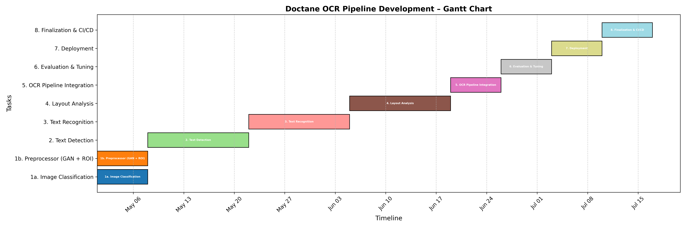

# For Dev needs : 

## USE datasets\cache_datasets AND model_weights -- TEMP FOLDERS - DON'T PUSH TEMP DATA !!!

### **📅 Timeline Overview**

<p align="center">
  
</p>

---

### ✅ Step-by-Step Development Plan

---

#### **1. Image Classification + Preprocessor**
**Timeframe:** Week 1–2

- **1a. Image Classifier**
  - Tasks: Train classifier(s) to identify:
    - Orientation (upright, rotated)
    - Quality (blurry vs. clear)
    - Script/language (Latin, Devanagari, etc.)
  - Output: Flags or metadata to guide preprocessing and recognition.

- **1b. Preprocessor**
  - Integrate **BSRGAN** for super-resolution.
  - Implement document ROI detection to crop out irrelevant areas.

📁 Files to update:
- `models/processor/`, `train/train_processor.py`, `eval/eval_processor.py`
- `configs/processor.yaml`

---

#### **2. Text Detection**
**Timeframe:** Week 3–4

- Model: Use DBNet, CRAFT, or YOLO-based detector.
- Output: Bounding boxes for detected text regions.

📁 Files to update:
- `models/detection/`, `train/train_detection.py`, `eval/eval_detection.py`, `infer/infer_detection.py`

---

#### **3. Text Recognition**
**Timeframe:** Week 5–6

- Model: CRNN, SAR, or Transformer-based recognizer.
- Input: Cropped boxes from detection step.
- Output: Recognized text per region.

📁 Files to update:
- `models/recognition/`, `train/train_recognition.py`, `eval/eval_recognition.py`, `infer/infer_recognition.py`

---

#### **4. Layout Analysis (Row/Column Detection)**
**Timeframe:** Week 7–8

- Use: Rule-based + ML (like PubLayNet-style models or GCNs).
- Output: Structured layout (tables, paragraphs, etc.)

📁 Files to update:
- `models/layout/`, `train/train_layout.py`, `eval/eval_layout.py`, `infer/infer_layout.py`

---

#### **5. OCR Pipeline Integration**
**Timeframe:** Week 9

- Integrate all components into `pipeline/ocr_pipeline.py`
- Use configuration control for pipeline stages.
- Modularize: classifier → preprocess → detect → recognize → layout.

📁 Focus:
- `pipeline/ocr_pipeline.py`
- `configs/pipeline.yaml`
- `infer/infer_image.py`

---

#### **6. Evaluation and Fine-tuning**
**Timeframe:** Week 10

- Use synthetic and real-world datasets.
- Compare end-to-end accuracy, F1 score, CER/WER.
- Visualize errors using `utils/visualizer.py`.

---

#### **7. Deployment**
**Timeframe:** Week 11

- **Options**:
  - REST API using FastAPI or Flask.
  - Batch inference script (`scripts/infer_batch.sh`)
  - Docker containerization
- Add support for:
  - GPU/CPU toggle
  - Configurable stages via CLI or YAML

📁 Files to update:
- `Dockerfile`, `scripts/`, `setup.py`, optionally create `app.py`

---

#### **8. Final Steps: Tests, Docs, CI/CD**
**Timeframe:** Week 12

- Write/expand unit tests under `tests/`
- Finalize README.md with usage examples.
- Add GitHub Actions or similar for CI.
- Publish Docker image / pip installable package (optional)

---


```
Doctane/
├── configs/                   # YAML configs for all models and stages
│   ├── processor.yaml
│   ├── detection.yaml
│   ├── recognition.yaml
│   ├── layout.yaml
│   └── pipeline.yaml
│
├── data/                      # Datasets and data loading logic
│   ├── __init__.py
│   ├── base_dataset.py
│   ├── processor_dataset.py
│   ├── detection_dataset.py
│   ├── recognition_dataset.py
│   └── layout_dataset.py
│
├── models/                    # Model architecture and logic
│   ├── processor/
│   │   ├── model.py
│   │   └── postprocess.py
│   ├── detection/
│   │   ├── model.py
│   │   └── box_utils.py
│   ├── recognition/
│   │   ├── model.py
│   │   └── decoder.py
│   ├── layout/
│   │   ├── model.py
│   │   └── layout_utils.py
│   └── __init__.py
│
├── pipeline/                  # Main orchestrator and pipeline utils
│   ├── ocr_pipeline.py        # Combines all stages
│   └── postprocess.py
│
├── train/                     # Training entry points
│   ├── train_processor.py
│   ├── train_detection.py
│   ├── train_recognition.py
│   └── train_layout.py
│
├── evaluate/                  # Evaluation and metrics
│   ├── eval_processor.py
│   ├── eval_detection.py
│   ├── eval_recognition.py
│   ├── eval_layout.py
│   └── metrics.py
│
├── infer/                     # Inference scripts for standalone and full pipeline
│   ├── infer_image.py         # Run full OCR on an image
│   ├── infer_detection.py
│   ├── infer_recognition.py
│   ├── infer_layout.py
│   └── infer_utils.py
│
├── utils/                     # Common utility functions
│   ├── config.py              # Load YAMLs
│   ├── logger.py              # Logging
│   ├── visualizer.py          # Draw boxes, results, etc.
│   └── seed.py                # Reproducibility
│
├── notebooks/                 # Prototyping and experiments
│   └── demo_ocr_pipeline.ipynb
│
├── scripts/                   # Automation scripts
│   ├── train_all.sh
│   ├── evaluate_all.sh
│   └── infer_batch.sh
│
├── tests/                     # Unit tests
│   ├── test_pipeline.py
│   ├── test_detection.py
│   └── test_recognition.py
│
├── requirements.txt
├── README.md
└── setup.py
```
